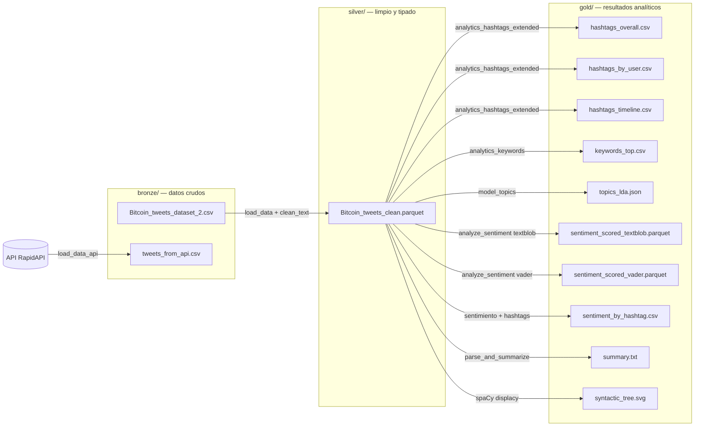

# Actividad Práctica U4 · Análisis de sentimiento y tendencias en redes sociales

Práctica de la asignatura **Búsqueda y Análisis de la Información** (BAIN) · UTAD.
Continuación de la práctica de la Unidad 2.

## Qué hay nuevo respecto a la U2

La U2 se quedó en extracción, limpieza y un análisis básico de hashtags con wordcloud. Para esta entrega he ampliado la clase `DataExtractor` con bastante más cosa:

| | U2 | U4 |
|---|---|---|
| Fuente de datos | Solo CSV local | CSV local **+ API de Twitter** (twitter-api45 en RapidAPI) |
| Almacenamiento | CSV en `data/` | Tres carpetas: `bronze/` (crudo), `silver/` (limpio en Parquet), `gold/` (resultados) |
| Carga del CSV | `pd.read_csv` directo | Polars con `infer_schema_length=None` y verificación cruzada con `csv.reader` para no perder filas |
| Hashtags | Top global y wordcloud | + por usuario, + evolución temporal, + análisis de concentración (¿hay bots?) |
| Keywords | No había | Top 30 con stopwords NLTK + dominio Twitter/cripto |
| Tópicos | No había | LDA con gensim, bigramas (`gensim.Phrases`) y coherencia c_v |
| Sentimiento | No había | TextBlob **y** VADER, comparados sobre la misma muestra |
| Sentimiento en el tiempo | No había | Evolución diaria + cruce hashtag × polaridad |
| Resumen | No había | Resumen extractivo por frecuencia de palabras |
| Parsing sintáctico | No había | Árbol de dependencias con spaCy + visualización con displacy |

La clase `DataExtractor` sigue siendo el punto central, pero ahora con un montón más de métodos.

## Datos

- API de Twitter via [twitter-api45 en RapidAPI](https://rapidapi.com/alexanderxbx/api/twitter-api45). Necesita una key (gratis, pero con cuota muy limitada).
  - Endpoint: `GET /search.php` con parámetros `query`, `search_type` y `cursor` (paginación).
  - La query por defecto usa el operador `OR` de Twitter (`bitcoin OR btc OR eth OR crypto`) para ampliar el universo a tickers y términos relacionados sin tener que repetir llamadas.
- Dataset local de Bitcoin Tweets de Kaggle: `Bitcoin_tweets_dataset_2.csv`. Se queda como respaldo por si la cuota de la API se agota.

## Estructura de la carpeta

```
data/
├── bronze/
│   ├── Bitcoin_tweets_dataset_2.csv     ← dataset original de Kaggle
│   └── tweets_from_api.csv              ← tweets bajados con la API
├── silver/
│   └── Bitcoin_tweets_clean.parquet     ← dataset limpio (Parquet pesa mucho menos)
└── gold/
    ├── hashtags_overall.csv
    ├── hashtags_by_user.csv
    ├── hashtags_timeline.csv
    ├── keywords_top.csv
    ├── topics_lda.json
    ├── sentiment_scored_textblob.parquet
    ├── sentiment_scored_vader.parquet
    ├── sentiment_by_hashtag.csv
    ├── summary.txt
    └── syntactic_tree.svg
```

### Flujo de datos



`tweets_from_api.csv` es la fuente principal del análisis (se acumula entre ejecuciones). El CSV de Kaggle queda como respaldo si la cuota gratis de la API se agota.

## Qué hace el notebook

0. Carga las credenciales de la API desde `.env`.
1. Lee el CSV de Kaggle con Polars y verifica que no se pierde nada raro.
   1.1. Llama a la API y baja unos tweets en tiempo real.
2. Limpia el texto de cada tweet (URLs, menciones, emojis, espacios), dejando los `#`.
3. Guarda el dataset limpio en silver como Parquet.
4. Saca el ranking de hashtags global, por usuario y la evolución diaria. Mira si hay bots.
5. Saca el top 30 de palabras clave filtrando stopwords.
6. Genera la wordcloud de hashtags.
7. Entrena un modelo LDA con bigramas y mide la coherencia c_v.
8. Calcula sentimiento con TextBlob y VADER, y los compara.
9. Genera un resumen extractivo del corpus.
10. Parsea sintácticamente un par de tweets de ejemplo con spaCy y guarda el árbol de dependencias como SVG.

## Por qué Parquet en silver y no CSV

Lo intenté primero con CSV y al volver a leerlo perdía los tipos (las fechas se quedaban como string), pesaba 5 veces más y a veces tenía problemas con tweets que llevaban comillas raras. Parquet me solucionó las tres cosas y de paso es más rápido al cargar.

## Credenciales

Hay que crear un `.env` en la raíz de la carpeta:

```
RAPIDAPI_KEY=tu_clave_aqui
```

El `.env` está en `.gitignore`. Hay un `.env.example` de plantilla.

## Cómo ejecutarlo

Necesita Python 3.10+ (yo lo he probado con 3.12).

```bash
# Crear el venv e instalar dependencias
python3 -m venv .venv_u4
source .venv_u4/bin/activate
pip install -r requirements.txt
python -m spacy download en_core_web_sm

# Copiar plantilla de .env y meter la key
cp .env.example .env
# editar .env con tu RAPIDAPI_KEY

# Lanzar el notebook
jupyter notebook Actividad_Practica_U24_DataExtractor.ipynb
```

Importante: el archivo `Bitcoin_tweets_dataset_2.csv` tiene que estar en `data/bronze/`.

Si usas VS Code o JupyterLab, asegúrate de que el kernel apunta al venv (`.venv_u4`). Si no, no encontrará pandas, polars ni nada.
