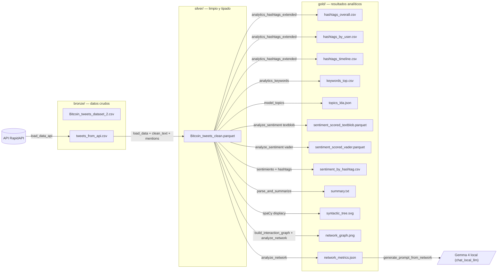

# Actividad Práctica U6 · Análisis de sentimiento y tendencias en redes sociales — Análisis de redes e integración de LLMs

Práctica de la asignatura **Búsqueda y Análisis de la Información** (BAIN) · UTAD.
Continuación de las prácticas de las Unidades 2 y 4.

## Qué añade la U6

Sobre la base de la U4 (extracción, limpieza, hashtags, tópicos, sentimiento y parsing) esta entrega añade dos bloques nuevos a la clase `DataExtractor`:

| | U6 |
|---|---|
| Análisis de redes | Grafo dirigido de menciones con NetworkX: métricas (grado, centralidad, intermediación), comunidades con Louvain y visualización |
| Insights de red | Top 3 usuarios por centralidad + hashtag más frecuente, guardados en `gold/network_metrics.json` |
| LLM en local | `google/gemma-4-E2B-it` con `transformers`; genera un análisis interpretativo de la red a partir de un prompt |
| App | Chat interactivo con el modelo en una interfaz Gradio (`scripts/app_gradio.py`) |

## Datos

- API de Twitter via [twitter-api45 en RapidAPI](https://rapidapi.com/alexanderxbx/api/twitter-api45). Necesita una key (gratis, pero con cuota muy limitada).
  - Endpoint: `GET /search.php` con parámetros `query`, `search_type` y `cursor` (paginación).
  - La query por defecto usa el operador `OR` de Twitter (`bitcoin OR btc OR eth OR crypto`) para ampliar el universo a tickers y términos relacionados sin tener que repetir llamadas.
- Dataset local de Bitcoin Tweets de Kaggle: `Bitcoin_tweets_dataset_2.csv`. Se queda como respaldo por si la cuota de la API se agota.

`tweets_from_api.csv` es la fuente principal del análisis (se acumula entre ejecuciones); el CSV de Kaggle es el respaldo.

## Estructura y flujo de datos

```
data/
├── bronze/
│   ├── Bitcoin_tweets_dataset_2.csv     ← dataset original de Kaggle
│   └── tweets_from_api.csv              ← tweets bajados con la API
├── silver/
│   └── Bitcoin_tweets_clean.parquet     ← dataset limpio
└── gold/
    ├── hashtags_overall.csv
    ├── hashtags_by_user.csv
    ├── hashtags_timeline.csv
    ├── keywords_top.csv
    ├── topics_lda.json
    ├── sentiment_scored_textblob.parquet
    ├── sentiment_scored_vader.parquet
    ├── sentiment_by_hashtag.csv
    ├── summary.txt
    ├── syntactic_tree.svg
    ├── network_graph.png         ← grafo de menciones (U6)
    └── network_metrics.json      ← métricas de red e insights (U6)
```



## Qué hace el notebook

0. Carga las credenciales (API de Twitter y Hugging Face) desde `.env`.
1. Llama a la API y acumula tweets en tiempo real; los lee con Polars (el CSV de Kaggle queda de respaldo).
2. Limpia el texto de cada tweet (URLs, menciones, emojis, espacios) dejando los `#`, y guarda aparte una columna `mentions` con las menciones del texto crudo (para el grafo).
3. Guarda el dataset limpio en silver como Parquet.
4. Saca el ranking de hashtags global, por usuario y la evolución diaria. Mira si hay bots.
5. Saca el top 30 de palabras clave filtrando stopwords.
6. Genera la wordcloud de hashtags.
7. Entrena un modelo LDA con bigramas y mide la coherencia c_v.
8. Calcula sentimiento con TextBlob y VADER, y los compara.
9. Genera un resumen extractivo del corpus.
10. Parsea sintácticamente un par de tweets de ejemplo con spaCy y guarda el árbol de dependencias como SVG.
11. Construye el grafo de menciones, calcula métricas y comunidades, y guarda el grafo y las métricas.
12. Genera un prompt con los insights de la red y se lo pasa a Gemma en local para obtener un análisis interpretativo.

## Documentación técnica

### Extracción de menciones

El grafo se construye a partir de las menciones (`@usuario`) de los tweets, pero `clean_text` las elimina al limpiar el texto. Por eso se añadió `extract_mentions`, que las saca del texto **crudo** y las guarda en una columna `mentions` al construir el silver, de modo que llegan intactas al análisis de red.

### Grafo y métricas (NetworkX)

`build_interaction_graph` crea un grafo dirigido (`nx.DiGraph`): por cada tweet, una arista del autor hacia cada usuario que menciona, con peso igual al número de menciones (se ignoran las autorreferencias).

`analyze_network` calcula sobre el grafo:

- **Centralidad de grado** (`degree_centrality`): cuántas conexiones tiene cada usuario respecto al total; detecta a los más mencionados/activos.
- **Centralidad de intermediación** (`betweenness_centrality`): cuántos caminos cortos pasan por un nodo; señala a quién hace de puente entre grupos.
- **Comunidades** con **Louvain** (`nx.community.louvain_communities`) sobre el grafo no dirigido, maximizando la modularidad.

Guarda `network_metrics.json` (métricas + top 3 por centralidad + hashtag más frecuente, reutilizando `analytics_hashtags_extended`) y `network_graph.png` (layout *spring*, nodos coloreados por comunidad y tamaño proporcional a la centralidad).

### Insights → prompt → LLM

`generate_prompt_from_network` compone un prompt con los insights de la red (top 3 usuarios por centralidad, hashtag dominante, número de comunidades y tamaño del grafo): al modelo se le pasa el resumen estructurado de la red, no los tweets en bruto.

`chat_local_llm` levanta el modelo con `transformers.pipeline("text-generation")`. Por defecto **`google/gemma-4-E2B-it`**; es multimodal, pero el pipeline de texto lo usa sin cambios. Tiene dos modos: con `prompt` devuelve una única respuesta (lo que usa el notebook); sin `prompt`, abre un chat interactivo por consola manteniendo el historial.

### Por qué Parquet en silver

Lo intenté primero con CSV y al volver a leerlo perdía los tipos (las fechas se quedaban como string), pesaba 5 veces más y a veces tenía problemas con tweets que llevaban comillas raras. Parquet me solucionó las tres cosas y de paso es más rápido al cargar.

### Rendimiento: CPU vs MPS

Latencia de generación con el mismo prompt y `max_new_tokens=120` (`gemma-4-E2B-it`, Mac M4 de 16 GB):

| Dispositivo | Tiempo | Velocidad |
|---|---|---|
| CPU | 12,9 s | 9,3 tok/s |
| MPS (GPU) | 10,2 s | 11,8 tok/s |

## Instalación y uso

Necesita Python 3.10+ (probado con 3.12). Hay que crear un `.env` en la raíz de la carpeta:

```
RAPIDAPI_KEY=tu_clave_aqui
HF_TOKEN=tu_token_de_huggingface
LLM_MODEL=google/gemma-4-E2B-it
```

El `.env` está en `.gitignore` y hay un `.env.example` de plantilla. `LLM_MODEL` es opcional y permite cambiar de modelo.

```bash
# Crear el venv e instalar dependencias
python3 -m venv .venv_u6
source .venv_u6/bin/activate
pip install -r requirements.txt
python -m spacy download en_core_web_sm

# Copiar la plantilla de .env y meter las claves
cp .env.example .env
# editar .env con tu RAPIDAPI_KEY y tu HF_TOKEN

# Lanzar el notebook
jupyter notebook Actividad_Practica_U6_DataExtractor.ipynb

# Para el chat interactivo en una app web:
python scripts/app_gradio.py
```

Importante: el archivo `Bitcoin_tweets_dataset_2.csv` tiene que estar en `data/bronze/`. La primera vez que se usa el LLM se descargan los pesos del modelo desde Hugging Face.
